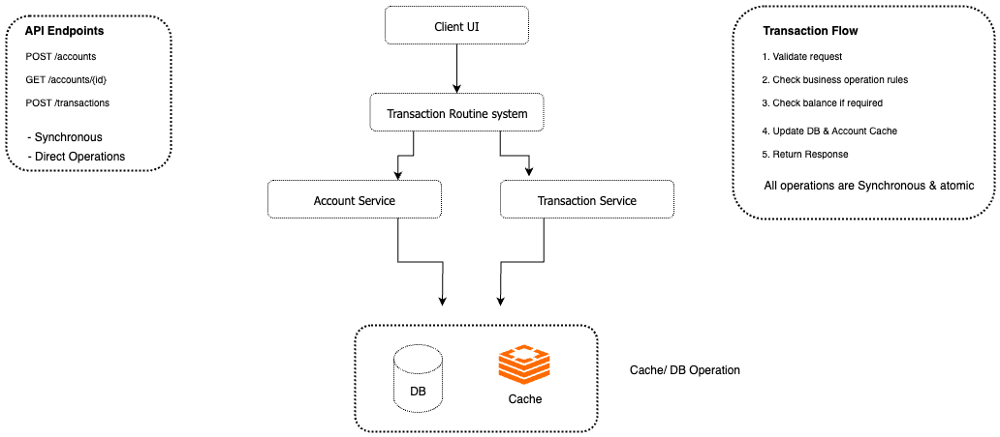

# Transaction Routine Service

Clean, simple transaction processing system built with maintainability and testability in mind.

## Quick Start

```bash
# To start Infrastructure & Application together
docker-compose up -d    # which will run PostgreSQL, Redis and along with the java application
```

OR

```bash
# To start Infrastructure separately
docker-compose up -d postgres redis

# Run the application in the same terminal or just start the spring boot application (TransactionRoutineApplication.java) in an IDE like intellij
./mvnw spring-boot:run
```

**API will be available at:** `http://localhost:8080`

---

## Overview

This solution prioritizes **simplicity** as requested in the evaluation criteria. The implementation focuses on clean, maintainable code with direct database operations for easy understanding and collaboration.

**Primary approach:** Synchronous operations with immediate consistency  
**Alternative exploration:** `feature/event-driven` branch demonstrates async patterns (see [Alternative Implementation](#alternative-implementation))

---

## Features

* Account creation & retrieval
* Transaction processing (purchases, withdrawals, payments)
* Real-time balance management
* Clean REST API design
* Comprehensive testing
* Docker-based setup for easy execution

---

## Architecture

Simple, direct architecture focusing on core business logic:




**Design Principles:**
- Direct database operations for immediate consistency
- Synchronous processing for predictable behavior
- Clean service separation (Account vs Transaction)
- Caching for performance optimization

---

## API Endpoints

### Account Management
- `POST /accounts` - Create a new account
- `GET /accounts/{accountId}` - Get account details

### Transaction Processing
- `POST /transactions` - Create a transaction (purchase/withdrawal/payment)

**Request/Response examples:**

### Create Account

```
POST /accounts
{
    "documentNumber": "12345678900"
}
```
        
### Create Transaction
```
POST /transactions
{
    "accountId": 1,
    "operationTypeId": 2,
    "amount": 5.00
}
```

---

## Tech Stack

* **Language:** Java 17
* **Framework:** Spring Boot 3.x
* **Database:** PostgreSQL with Spring Data JPA
* **Cache:** Redis for account data
* **Infrastructure:** Docker Compose
* **Testing:** JUnit 5, Spring Boot Test

---

## Design Decisions

### Balance Update Management
Added `availableBalance` field to Account entity for real-time balance tracking - essential for transaction systems.

### Simplicity Focus
- **Direct operations:** All API calls result in immediate database updates
- **Synchronous flow:** Predictable request-response patterns
- **Single application:** No distributed complexity
- **Clear service boundaries:** Account and Transaction services with distinct responsibilities

### Caching Strategy
Redis caching for frequently accessed account data to improve performance without adding complexity to the core flow.

---

## Project Structure

```
txn-routine-svc/
 ├── src/main/java/com/poc/transaction/
 │   ├── api/      # REST Controllers
 │   ├── service/         # Business logic (AccountService, TransactionService)
 │   ├── repository/      # Data Access Layer
 │   ├── model/           # Entities & DTOs
 │   ├── config/          # Configuration Classes
 │   ├── exception/       # exception Classes & global exception handler
 │   └── TransactionRoutineApplication.java
 ├── src/test/java/...    # Unit & Integration tests
 ├── pom.xml              # Maven dependencies
 ├── docker-compose.yml   # Docker setup DB, Cache, etc
 └── README.md
```

---

## Running the Application

### Option 1: Docker Compose (Recommended)
```bash
# Start all services including PostgreSQL, Redis, and the application
docker-compose up -d
```

### Option 2: Local Development
```bash
# Start the infrastructure like PostgreSQL and Redis are running using below docker cmd
docker-compose up -d postgres redis

# Build and run the application using maven wrapper in the terminal or just start the spring boot application (TransactionRoutineApplication.java) in an IDE like intellij
./mvnw clean install
./mvnw spring-boot:run
```

### Running Tests
```bash
./mvnw test              # Unit tests
./mvnw verify            # Integration tests
```

---

## Alternative Implementation

**Interested in event-driven patterns?** 

Check the `feature/event-driven` branch for a demonstration of how this system could scale with:
- Async audit logging via Kafka simulation (mocked)
- Event-driven notifications (mocked)
- Saga pattern exploration for distributed transactions

**Note:** The event-driven branch is a learning exercise showing async patterns within the same Spring Boot application. The main branch remains the primary, production-ready solution optimized for clarity and maintainability.

```bash
# Explore the event-driven approach
git checkout feature/event-driven
```

---

## Production Considerations

While this implementation prioritizes simplicity, in a production environment I'd consider:

- **Async audit logging** via message queues for compliance
- **Event-driven notifications** for real-time user updates  
- **Distributed caching** strategies for high availability
- **API rate limiting** and authentication
- **Monitoring and observability** (metrics, tracing, logging)
- **Fault tolerance patterns** (circuit breakers, retries, fallbacks)

---